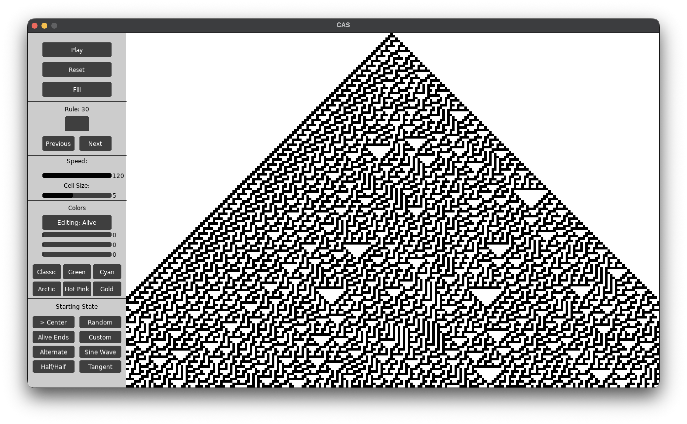
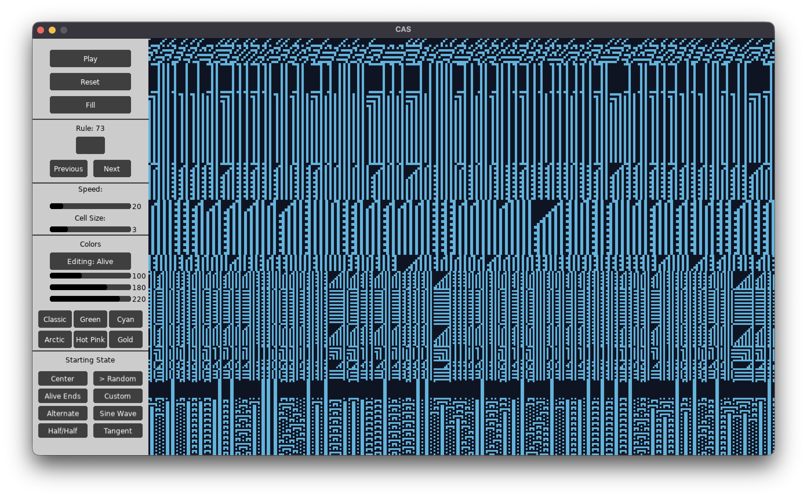
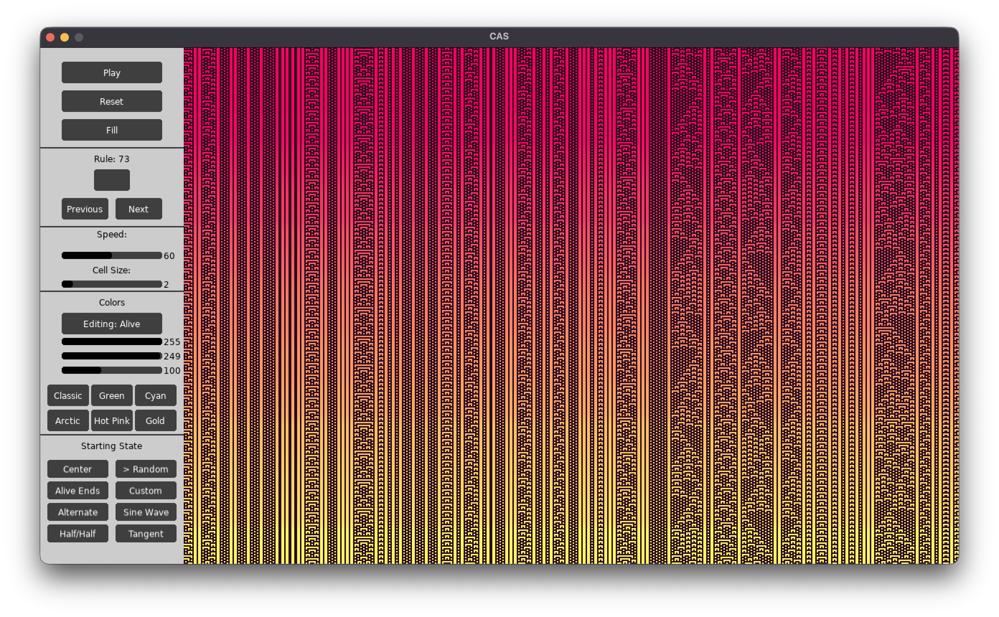

# CAPE

**Cellular Automata Pattern Explorer** is a small LÖVE app for exploring elementary cellular automata and layering patterns on a persistent canvas.

An elementary cellular automaton is a row of cells with two possible states. Each cell's next state depends on its current state and its two immediate neighbors, as determined by one of 256 rules. [Read more](https://en.wikipedia.org/wiki/Elementary_cellular_automaton).

## Screenshots







## Features

- Explore all 256 elementary cellular automaton rules.
- Choose from several starting states, including centered, random, alternating, half-and-half, and wave patterns.
- Adjust playback speed and cell size, or pause and use **Fill** to complete the current screen.
- Pick alive and dead colors independently with RGB sliders, or choose from color presets.
- Layer patterns on the same canvas: changing the rule or starting state leaves existing pixels in place. **Reset** clears the canvas for a fresh composition.

## Run

Install [LÖVE](https://love2d.org/), then run from the project directory:

```sh
love .
```

## Controls

- `Space`: pause or resume
- `R`: toggle repeating
- `S`: toggle scrolling
- `Left` / `Right`: previous or next rule
- `Up` / `Down`: increase or decrease cell size
- `Escape`: quit

The panel provides rule entry, speed and cell-size sliders, Fill and Reset, starting-state selection, and color controls.
